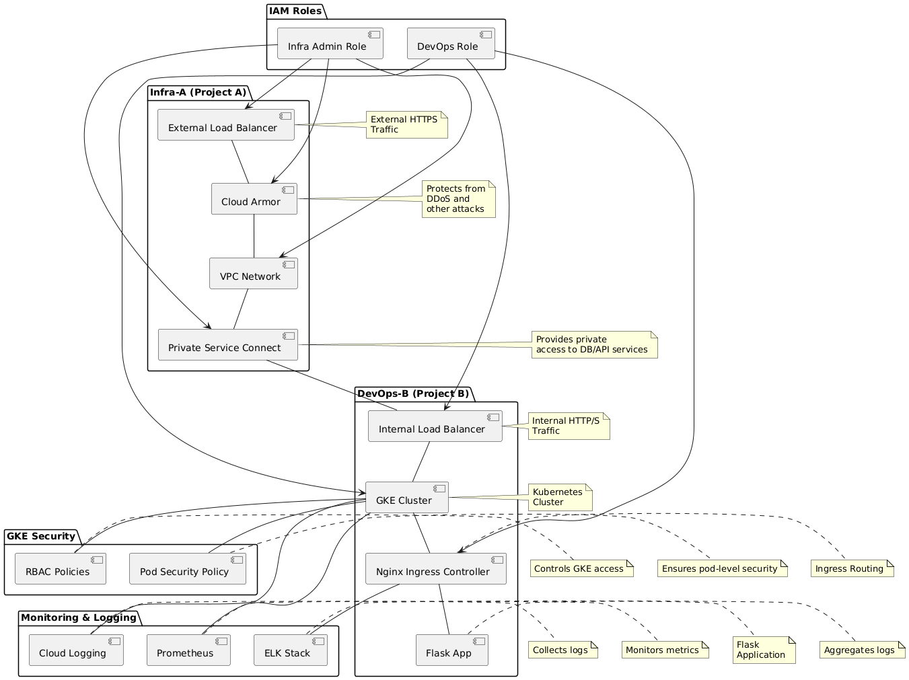

# GCP Infrastructure with Terraform

## Project Structure: Infra-A & DevOps-B

This repository follows a **clear separation of concerns**:

- **Infra-A (Infrastructure Project A):** Manages security, networking, load balancing, and global policies.
- **DevOps-B (DevOps Project B):** Handles application deployment, GKE, CI/CD pipelines, and Kubernetes operations.

This distinction ensures:
- **Secure and scalable infrastructure** managed by Infrastructure Teams.
- **Efficient DevOps automation** for applications managed by Platform/DevOps Teams.
- **Separation of IAM roles and access policies** between network security and application teams.

## Directory Structure
```
/terraform
  ├── README.md                   # Documentation
  ├── modules/
  │   ├── a-infra/                 # Infrastructure Project A
  │   │   ├── vpc.tf
  │   │   ├── load_balancer.tf
  │   │   ├── cloud_armor.tf
  │   │   ├── variables.tf
  │   │   ├── outputs.tf
  │   │   ├── TODO-High.md          # High-level infra tasks
  │   │   └── README.md             # Infra-A documentation
  │   ├── b-devops/                # DevOps Project B
  │   │   ├── gke.tf
  │   │   ├── ingress.tf
  │   │   ├── flask_app.tf
  │   │   ├── variables.tf
  │   │   ├── outputs.tf
  │   │   ├── TODO-Low.md           # Detailed DevOps tasks
  │   │   └── README.md             # DevOps-B documentation
  ├── environments/
  │   ├── dev/                     # Terraform configs for Dev
  │   ├── prod/                    # Terraform configs for Prod
  ├── main.tf                      # Main Terraform file
  ├── variables.tf
  ├── outputs.tf
  ├── backend.tf                   # Remote Terraform state configuration
```

## Deployment Steps

### Prerequisites
- Terraform >= 1.3.0 installed
- Google Cloud SDK installed & authenticated
- GCP Project with Billing enabled

### Clone the repository
```bash
git clone https://github.com/dzzk-r/ha-gcp-1.git
cd ha-gcp-1
```

### Configure Terraform
Create a `.tfvars` file with your configuration:
```hcl
project_id = "your-gcp-project-id"
region     = "us-central1"
```

### Initialize Terraform
```bash
terraform init
```

### Plan and apply changes
```bash
terraform plan
terraform apply --auto-approve
```

### Verify Deployment
- Use `gcloud compute instances list` to check resources.
- Access the external Load Balancer using the output URL.


### How HA is Achieved?
- Multi-region setup for Load Balancers.
- Auto-healing GKE nodes using managed instance groups.
- Horizontal Pod Autoscaler (HPA) for scaling workloads dynamically.

### Future Enhancements
- Add monitoring (Prometheus + Grafana)
- Improve secrets management (GCP Secret Manager)


### Architecture Diagram



via [eraser.io AI Diagram Generator](https://www.eraser.io/ai/architecture-diagram-generator)
